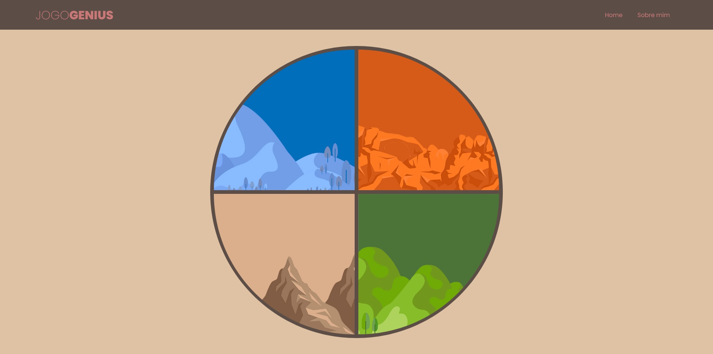

<h1 align="center">Jogo Genius</h1>

  Jogo de memória estilo Genius utilizando apenas HTML, CSS, manipulação de arrays e arrow functions

  
  
Criado no Bootcamp da Eduzz em parceria com a DIO. 

 

<code>yarn install</code> ou para instalar as dependências.

<code>yarn start</code> para executar localmente em http://localhost:3000/

Acesse o link para ver o projeto online! https://genius-game-bootcamp.herokuapp.com/

